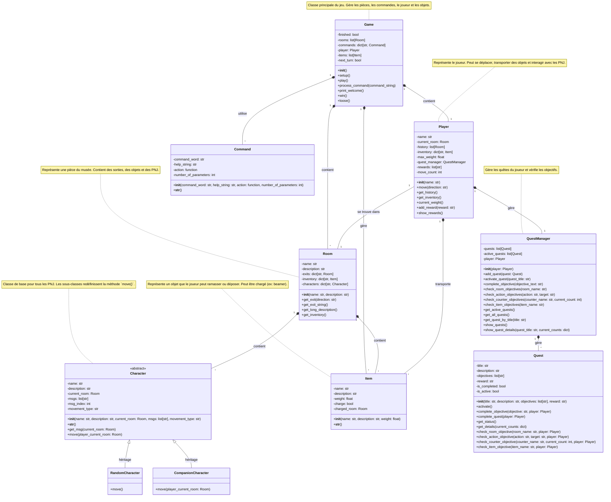

# Rapport de projet TBA : Fantaseum

Ce dépôt contient le rapport du projet *Fantaseum*, un jeu d’aventure et de réflexion développé dans le cadre d’un projet académique.
Ce rapport a pour objectif de présenter le jeu, son fonctionnement et sa conception. Il comprend un guide utilisateur décrivant l’installation du jeu, son univers, les règles et la manière d’y jouer, ainsi qu’un guide développeur détaillant l’architecture du projet et le diagramme de classes. Enfin, il expose les perspectives de développement envisagées pour l’évolution du jeu.

## Guide utilisateur :
Cette partie du rapport présente le jeu du point de vue de l’utilisateur. Elle décrit les étapes d’installation, l’univers du jeu, les objectifs, les conditions de victoire et de défaite, ainsi que les commandes et le déroulement.

### Installation du jeu
Le jeu *Fantaseum* est développé en **Python** et s’exécute dans un **terminal**.  
Aucune interface graphique n’est nécessaire pour lancer et jouer au jeu.

##### Prérequis
Avant de commencer, assurez-vous de disposer des éléments suivants :
- Une version récente de **Python** installée sur votre machine ;
- Un terminal (Invite de commandes, PowerShell, Terminal Linux ou macOS) ;
- **Git** (optionnel, pour cloner le dépôt).
#### Récupération du projet
Le projet peut être récupéré de deux manières :
- en clonant le dépôt GitHub afin de l'avoir en local via :
git clone https://github.com/Kensany-patoupe-chenou/TBA.git
- ou en téléchargeant l’archive ZIP du projet depuis GitHub.
### Description du jeu
#### Synopsys
*Fantaseum* se déroule dans un musée mystérieux où le joueur incarne un employé resté enfermé après la fermeture.  
Au fil de la nuit, le musée devient de plus en plus étrange, donnant l’impression qu’il est habité par une présence surnaturelle.

Tout le long de l’aventure, le joueur est accompagné par **Tingen**, un personnage non joueur qui le guide tout au long de son exploration.  
**Gripsou**, le spectre d’un ancien conservateur du musée et créateur de Tingen son alter égo né de son attachemen profond à ces lieux, erre quant à lui de manière aléatoire dans les différentes salles du musée, rendant chaque exploration imprévisible.

Pour pouvoir quitter le musée avant l’aube, le joueur doit explorer les salles et accomplir différentes **quêtes**. Celles-ci consistent notamment à atteindre des lieux précis, récupérer des objets ou interagir avec des personnages.  
La progression du jeu repose sur la réalisation de ces quêtes, indispensables pour débloquer la sortie du musée.

#### Objectif et conditions de fin
L’objectif principal du joueur est de **quitter le musée d'ici l’aube**.  
Pour y parvenir, il doit explorer les différentes salles du musée et **accomplir les quêtes nécessaires**.

La partie peut se terminer de deux manières :

- **Victoire** :  
  Le joueur parvient à sortir du musée après avoir accompli l’ensemble des quêtes requises.

- **Défaite** :  
  La partie est perdue si le joueur entre dans une **salle dangereuse sans être protégé**.  
  En l'occurence, dans la salle consacrée aux *serial killers*, le joueur doit posséder une **plante médicinale**. S’il entre dans cette salle sans cet objet, il perd automatiquement la partie, sa vie étant mise en danger à la suite d’un accident provoqué par Tingen.
#### Les différentes quêtes
La progression dans *Fantaseum* repose sur la réalisation de plusieurs types de quêtes. Ces quêtes permettent au joueur d’explorer le musée, d’interagir avec son environnement et de réunir les éléments nécessaires pour pouvoir quitter les lieux en toute sécurité.

On distingue trois types de quêtes principales :

- **Quête d’item** :  
  Le joueur doit récupérer un objet spécifique situé dans une salle précise du musée. Ces objets peuvent être indispensables à la progression du jeu ou à la survie du joueur, comme la plante médicinale.

- **Quête de déplacement** :  
  Le joueur doit atteindre une salle donnée du musée. Ce type de quête encourage l’exploration des différents espaces et permet de guider la progression du joueur à travers les salles thématiques.

- **Quête d’interaction** :  
  Le joueur doit interagir avec un personnage non joueur spécifique, notamment Tingen ou Gripsou. Ces interactions permettent d'en apprendre plus sur le personnage avec qui l'on souhaite intéragir.

L’ensemble de ces quêtes structure le déroulement du jeu et conditionne l’accès à la sortie du musée.
#### Les Commandes du jeu
Le jeu *Fantaseum* se joue en mode console et repose sur un système de commandes textuelles saisies par le joueur.  
Ces commandes permettent de se déplacer dans le musée, d’interagir avec l’environnement, de gérer l’inventaire et de suivre la progression des quêtes.

- `go <direction>` : permet de déplacer le joueur dans une direction donnée (nord, sud, est, ouest, haut, bas) si un passage est disponible ;
- `back` : permet de revenir à la salle précédemment visitée, lorsque cela est possible ;
- `look` : affiche la description de la salle courante ainsi que les objets et personnages présents dans celle-ci ;
- `take <objet>` : permet de ramasser un objet présent dans la salle et de l’ajouter à l’inventaire du joueur, sous réserve des contraintes de poids ;
- `drop <objet>` : permet de déposer un objet de l’inventaire du joueur dans la salle courante ;
- `check` : affiche le contenu de l’inventaire du joueur ainsi que le poids actuel transporté ;
- `talk <personnage>` : permet d’interagir avec un personnage non joueur présent dans la salle ;
- `history` : affiche l’historique des salles visitées par le joueur ;
- `charge` : permet de charger l’objet *beamer* avec la salle actuelle afin de préparer une téléportation ;
- `use` : permet d’utiliser le *beamer* pour se téléporter vers la salle précédemment enregistrée ;
- `quests` : affiche la liste des quêtes disponibles et leur état (activée ou non) ;
- `quest <nom de la quête>` : affiche le détail d’une quête spécifique et la progression associée ;
- `activate <nom de la quête>` : permet d’activer une quête donnée ;
- `rewards` : affiche les récompenses obtenues par le joueur ;
- `help` : affiche la liste des commandes disponibles ;
- `quit` : permet de quitter le jeu.
### Comment jouer ?
Au lancement du jeu, le joueur incarne un employé du musée et débute son aventure dans **les vestiaires**. 
Dans cette salle initiale, comme dans toutes les autres il peut déjà observer son environnement et consulter les objets présents à l’aide des commandes prévues à cet effet.

Une fois le joueur sorti des vestiaires, **il ne peut plus y retourner** : l’accès se bloque définitivement. Cette étape marque le début réel de l’aventure.  
Le joueur arrive alors dans le **hall inférieur**, où il fait la rencontre de **Gripsou**, le spectre d’un ancien conservateur du musée. Au cours de cet échange, Gripsou propose au joueur la compagnie de **Tingen** , un personnage non joueur qui l'accompagnera durant toute la durée du jeu.

La progression dans le jeu repose principalement sur l’accomplissement de **quêtes**.  
Pour consulter les quêtes disponibles, le joueur doit utiliser les commandes appropriées :

- `quests` : affiche la liste des quêtes existantes.

Pour obtenir des informations détaillées sur une quête précise, il doit saisir :

- `quest <nom de la quête>` : affiche les objectifs, la progression et la récompense associée.

Avant de pouvoir accomplir une quête, il est **obligatoire de l’activer** à l’aide de la commande :

- `activate <nom de la quête>`

Une quête non activée ne peut pas être validée. Ainsi, si le joueur réalise une action correspondant à une quête sans l’avoir activée au préalable, celle-ci ne sera pas prise en compte et **aucune récompense ne sera obtenue**.

Une fois les quêtes activées, le joueur peut explorer les différentes salles du musée en se déplaçant à travers la carte. Cette exploration lui permet de découvrir de nouveaux lieux, de récupérer des objets nécessaires à certaines quêtes et d’interagir avec les personnages non joueurs à l’aide des commandes appropriées.

#### Objet magique : le Beamer

Le jeu contient un **objet magique appelé Beamer**, qui permet au joueur de se **téléporter instantanément dans une salle** du musée.  
Pour fonctionner, le Beamer doit d’abord être **chargé dans une salle** : la salle dans laquelle le joueur se trouve au moment du chargement deviendra la **destination de téléportation**.  
Le Beamer doit impérativement être **conservé dans l’inventaire** du joueur pour pouvoir être utilisé.  
⚠️ À noter que le Beamer **ne peut stocker qu’une seule salle à la fois** : charger une nouvelle salle remplace automatiquement la précédente. De plus, **il est impossible d’utiliser le Beamer s’il n’a pas été chargé au préalable**.

Le joueur doit également faire preuve de vigilance : certaines salles du musée sont **dangereuses**. L’accès à ces salles nécessite de posséder un **objet spécifique** au préalable. Entrer dans une salle dangereuse sans cet objet entraîne immédiatement la perte de la partie, le joueur perdant la vie à la suite d’un accident.

Enfin, il est essentiel de noter que **l’orthographe et la syntaxe des commandes sont strictement prises en compte**. Toute erreur dans l’écriture d’une commande, du nom d’un objet ou d’une quête empêchera son exécution correcte. Le joueur doit donc veiller à saisir chaque commande avec précision afin de progresser dans le jeu.

Pour réussir et sortir du musée d'ici l’aube, le joueur doit donc gérer ses déplacements, ses interactions, son inventaire et l’activation de ses quêtes avec attention.

## Guide développeur
Cette partie du rapport traite de la conception et de la structure du jeu. Elle détaille l’architecture du projet, l’organisation des classes et leurs relations, notamment à travers un diagramme de classes.

### Diagramme de classes
Le diagramme de classes ci-dessous présente la structure du jeu et les relations entre les différentes classes qui le composent. Il permet de visualiser l’organisation générale du projet et les interactions entre ses principaux éléments.

Le jeu est structuré autour de plusieurs fichiers, chacun regroupant des fonctionnalités spécifiques et correspondant à une partie précise de son fonctionnement. La liste ci-dessous présente les différents fichiers constituant le projet :

- `game.py` / `Game` : description de l'environnement, interface avec le joueur ;
- `room.py` / `Room` : propriétés génériques d'un lieu  ;
- `player.py` / `Player` : le joueur ;
- `command.py` / `Command` : les consignes données par le joueur ;
- `actions.py` / `Action` : les interactions entre .
- `charactere.py` / `Charactere` : propriétés génériques des personnages non joueurs (pnj) du jeu.
- `item.py` / `Item` : propriétés génériques des différents objets du jeu.
- `quest.py` / `Item` : gestion des différentes quêtes du jeu.

## Perspectives de développement
Plusieurs axes d’amélioration et d’évolution peuvent être envisagés pour enrichir le jeu à l’avenir :

- **Ajout de nouvelles salles** : introduire d’autres salles thématiques (art moderne, espace, civilisations disparues, etc.) afin d’allonger la durée de vie du jeu et de varier les environnements.

- **Diversification des quêtes** : proposer des quêtes plus complexes, combinant plusieurs objectifs (enchaînement d’objets, interactions multiples, conditions temporelles).

- **Évolution des PNJ** : approfondir le rôle de Tingen avec davantage de dialogues contextuels et rendre le comportement de Gripsou plus stratégique ou plus menaçant selon l’avancée du joueur.

- **Système de difficulté** : intégrer plusieurs niveaux de difficulté influençant la dangerosité des salles, la rareté des objets ou la fréquence d’apparition de Gripsou.

- **Sauvegarde de la progression** : permettre au joueur de sauvegarder et reprendre sa partie à tout moment.

- **Amélioration de l’interface utilisateur** : rendre les commandes plus intuitives, ajouter des indications visuelles.

## Conclusion:
Ce projet a été l’occasion de consolider et d’approfondir nos connaissances en Python, en particulier sur la programmation orientée objet, la structuration d’un projet et la gestion de la logique de jeu.  
Il nous a également permis de mieux comprendre comment concevoir un jeu textuel cohérent, en liant narration, quêtes, interactions et règles de gameplay.  
Au-delà de l’aspect technique, ce projet a renforcé notre capacité à analyser un problème, à le découper et à proposer des solutions fonctionnelles et évolutives.

## Assistance à la rédaction
Nous tenons respectueusement à préciser que, en plus des conseils et interventions de notre intervenante, qui nous ont guidés pour résoudre certaines situations et améliorer notre projet, nous avons également eu recours à l’intelligence artificielle. Celle-ci nous a aidés non seulement dans la rédaction, la mise en forme et la clarification de ce rapport, mais aussi pour **déboguer certaines situations dans le code**, tout en veillant à préserver le contenu technique ainsi que les idées originales issues de notre travail.